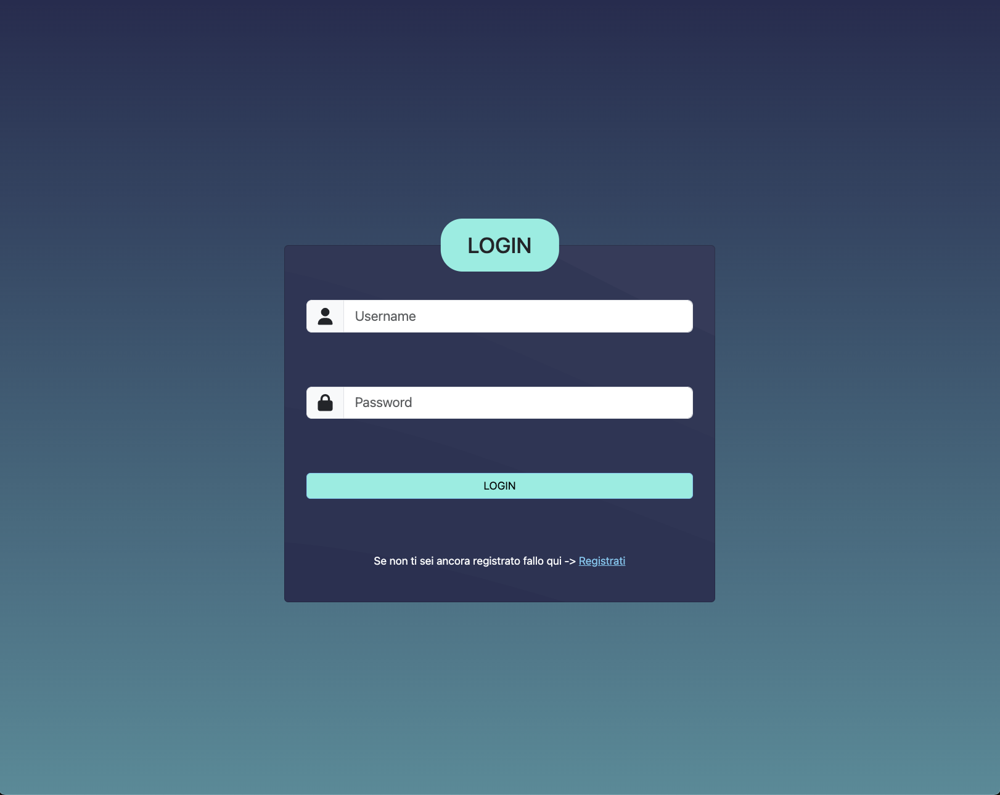
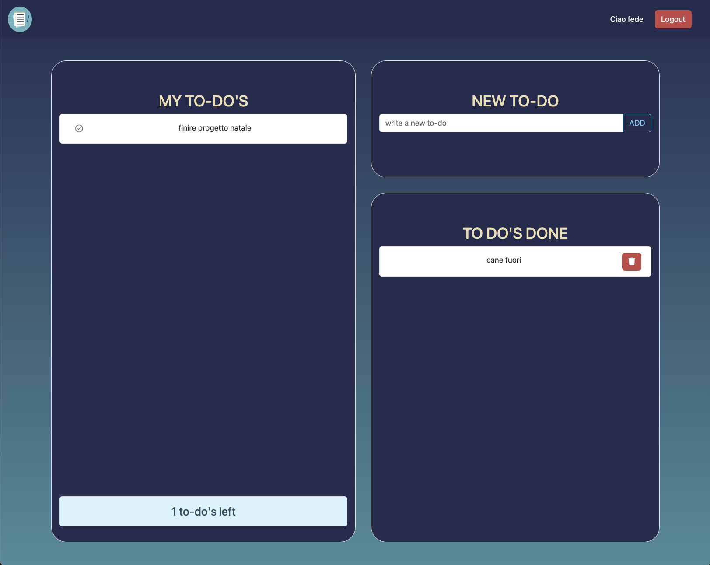

### My To-To List

---

**Schermata LOGIN**
In questa schermata l'utente ha la possibilità di accedere alla piattaforma, solo se ha effettuato la registrazione, ed iniziare a programmare la propria giornata. Se non ha mai effettuato l'accesso il link lo indirizzerà alla pagina di registrazione:

---

**Schermata principale**

- A sinistra l'utente ha la sezione per vedere tutte le to-do mancanti, con un counter sotto che renderà più facile il calcolo in caso di molti to-do, e con l'apposito bottone sulla sinistra potrà spuntare il to-do eseguito.

- Il to-do eseguito andrà nella sezione TO DO'S DONE, all'interno della quale sarà sottolineato per rendere intutitivo il completamento di quest'ultimo. Sulla destra della task possiamo cliccare il bottone rosso, per eliminare definitivamente il to.-do, anche dal database.

- Attraverso la sezione NEW TO-DO possiamo creare una nuova task e ci verrà mostrata nella sezione dei MY TO-DO'S.

Per effettuare il logout definitivo, siccome anche chiudendo la pagina il browser ricorderà del nostro accesso, basta che l'utente prema il bottone di logout e verrà reinderizzato alla schermata di LOGIN.